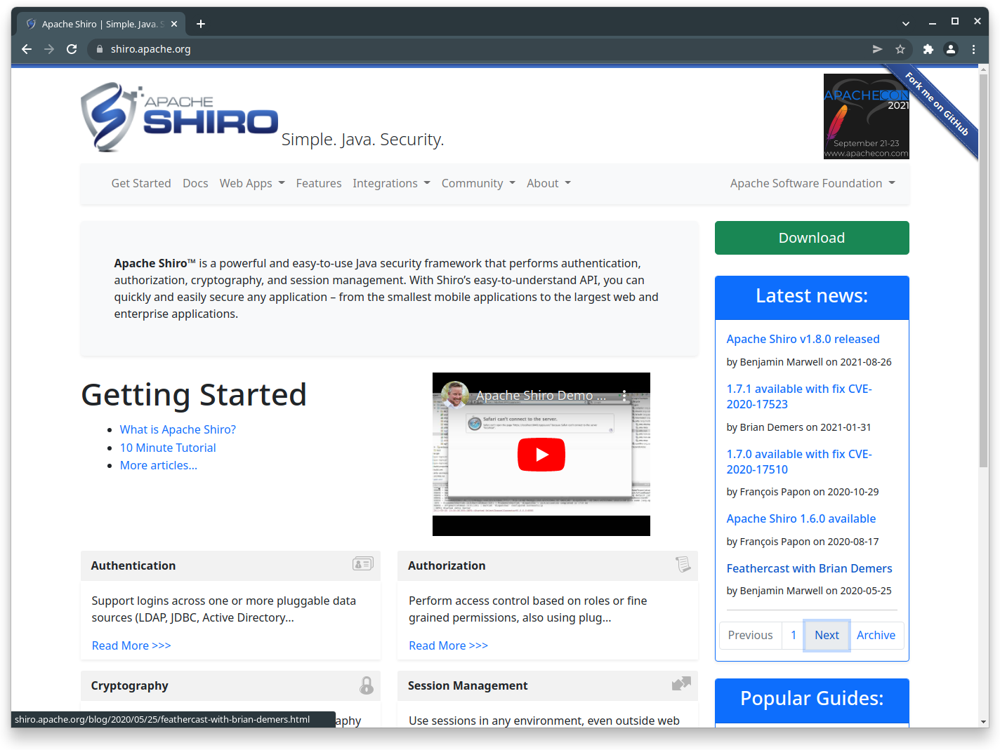

= The new Apache Shiro website is live!
:jbake-author: Benjamin Marwell
:jbake-date: 2022-02-09 15:43:22
:jbake-type: post
:jbake-status: published
:jbake-tags: website
:jbake-featuredimage: 2022-02-08T110829_screenshot.png
:jbake-featuredimagewidth: 1424
:jbake-featuredimageheight: 1069
:jbake-twittercard: large
:idprefix:

The Shiro team is pleased to announce the release of the new Apache Shiro website!

== New technology stack

The new website is built using link:https://jbake.org/[jbake] now.
Before that, we used link:https://github.com/lhazlewood/scms[SCMS] to build the site, which we did not maintain anymore.
Due to this change, the website can now be built using Apache Maven.

The new website allows us to use variables more easily throughout the site and to use link:https://asciidoctor.org/[asciidoctor] everywhere.

The new site also uses link:https://getbootstrap.com/[bootstrap 5] instead of bootstrap 3, which is much more mobile friendly and allows us to discard the jQuery library.

== Screenshots

Desktop site::

Mobile site::

image:2022-02-08T111522_screenshot_mobile.png["Apache Shiro mobile website",270,400]

== Ongoing restructuring

In the future, we might move some pages to a link:https://issues.apache.org/jira/browse/SHIRO-858[`/v1/<category>` subfolder].
Of course the old URLs will be redirected.

The feed is also not working yet and will be made available later this month.

== Feedback appreciated!

If you have any suggestions regarding the site, feel free to link:/issues.html[open an issue] or write us a message to the link:/mailing-lists.html[developer's mailing list]!
